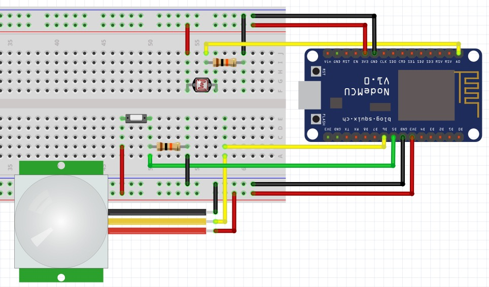

# NodeMCU toilet project integrated with AWS IoT

__This is work in progress. I've just uploaded my CRUD project files for now. Please be patient with me.__

### TL;DR



* Hook up your sensor: `SWITCH` = `D5`, `LIGHT` = `A0` and `MOTION` = `D6`.
* Run a couple of commands:
```bash
$ cp ./platformio-dist.ini platformio.ini
$ pio lib install PubSubClient
```

Edit `platformio.ini` with your credentials and other settings.

Upload and run your code:
```bash
$ pio run -e nodemcuv2 -t upload && pio serialports monitor -b 115200
```

Weee :-)

... more to come.

# Contribute
Please contribute with pull-requests.